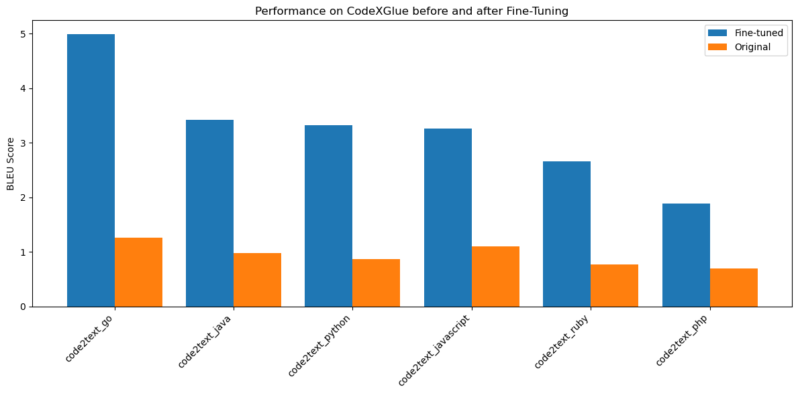
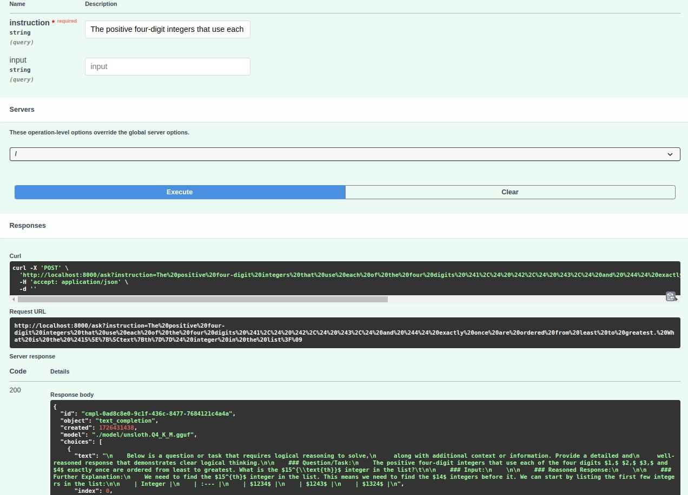

# LogicGPT
This repository contains the implementation of **LogicGPT**, a fine-tuned version of Mistral 7B, it was fine-tuned on tasks such as logical reasoning, code generation, and comprehension questions. Below are the steps and details regarding model selection, quantization, fine-tuning, evaluation, API creation, containerization, and CI/CD pipeline.
 
## 1. Model Selection
The model selected for this project is **Mistral 7B**, it is chosen for the following reasons:
- **Quantization support**: The model can be quantized while maintaining good performance, in terms of remembering a conversation and applying it to the context, thus enabling effective deployment on CPU for inference.
- **Resource efficiency**: The model can be run on commercial computers with GPU; and, in this project, the final inference is executed on a CPU, making it accessible to wider usage.=
- **Faster and better inference**: Mistral 7B uses a novel attention mechanism called **Grouped Query Attention**, along with increased attention heads, a larger context length, and a **Key-Value cache** to boost performance.

## 2. Quantization
Quantization was performed to enable faster inference on my local machine without a GPU. I used the **q4_k_m** quantization format, which offers a balanced quality and the final model is medium-sized. The quantization process is outlined in the notebook [finetuning.ipynb](https://github.com/SYusupov/LogicGPT/blob/main/finetuning.ipynb).

## 3. Model Fine-Tuning
### Dataset
For fine-tuning, I used the [Open-Platypus](https://huggingface.co/datasets/garage-bAInd/Open-Platypus) dataset. It contains questions from diverse domains such as math, science, reading comprehension, coding, and logic.

The number of training sets of questions and answers for each of the data sources can be seen in the plot below. The data sources are not uniformly distributed at all.
<p align="center">
 
</p>

The dataset was chosen for several reasons:
- **LLM performance on logic and math**: LLMs often struggle with logical reasoning and math tasks, so I wanted to see if I could improve this through fine-tuning.
- **Preprocessing**: The dataset underwent extensive preprocessing by the authors, including:
  - Removal of sentence pairs with over 80% similarity, calculated using **Sentence Transformers** and keyword search.
  - Exclusion of questions resembling those in Hugging Face benchmark test sets.
- **Variety of sources**: This allows for evaluating performance changes across a variety of tasks.

### Fine-Tuning Methodology

The fine-tuning process involved:
- **Unsloth**, a framework that facilitates fast and efficient fine-tuning.
- **SFTTrainer** from Hugging Face's **Transformers** library, which simplifies supervised fine-tuning tasks.

I used the **LoRA (Low-Rank Adaptation)** method for fine-tuning, setting the **rank parameter** to 16. Higher values can be used to improve performance further. The fine-tuning process is available in [`finetuning.ipynb`](https://github.com/SYusupov/LogicGPT/blob/main/finetuning.ipynb), which was run on Google Colab using a free **NVIDIA T4 GPU**.

## 4. Model Evaluation

### Evaluation Setup
To evaluate both the **original** and **fine-tuned** Mistral 7B models, I used the [lm-evaluation-harness](https://github.com/EleutherAI/lm-evaluation-harness) framework.

The fine-tuned model was evaluated as follows:
1. I launched the server with the GGUF model using [llama-cpp-python](https://github.com/abetlen/llama-cpp-python):
   ```bash
   python -m llama_cpp.server --model model/unsloth.Q4_K_M.gguf
   ```
2. I ran the evaluation with lm-evaluation-harness passing the local server address of the model:
   ```bash
   lm_eval --model gguf --model_args base_url=http://localhost:8000 --tasks <task-name> --limit <number-of-questions> --log_samples --output_path '<results-output-path>'
   ```

For evaluating the **original Mistral 7B** model, I used Google Colab to speed up the process. The corresponding evaluation code is available in [evaluation/original_model_evaluation.ipynb](https://github.com/SYusupov/LogicGPT/blob/main/evaluation/original_model_evaluation.ipynb).

### Evaluation Tasks
I evaluated both models on tasks similar to those in the fine-tuning dataset, including:
- **Science questions** from [SciQ](https://huggingface.co/datasets/allenai/sciq).
- **Code-to-text tasks** (i.e. comment generation for a code) from [CodeXGLUE](https://github.com/microsoft/CodeXGLUE).
- **Numerical calculations** from [Arithmetic](https://huggingface.co/datasets/EleutherAI/arithmetic).
- **Reading comprehension** from [MC_TACO](https://huggingface.co/datasets/CogComp/mc_taco).
- **Logical reasoning** from [LogiQA](https://github.com/csitfun/LogiQA2.0).

### Metrics and Results
The metrics used for evaluation were:
- **Smoothed BLEU-4** for the **CodeXGLUE** task (natural language generation), which focuses on n-gram matches between expected and actual outputs, ignoring the order.
- **Accuracy** for all other datasets (multiple-choice or discrete outputs).

#### Results Summary
The results, based on 20 questions per programming language for *CodeXGLUE* dataset, and 50 questions per question type for other datasets, can be seen in the folder [evaluation](https://github.com/SYusupov/LogicGPT/tree/main/evaluation). They are visualized in [evaluation/visualization.ipynb](https://github.com/SYusupov/LogicGPT/blob/main/evaluation/visualization.ipynb).

<p align="center">
 
</p>

As can be seen from the plot on accuracies above, the Fine-tuned model either matches or outperforms the Original Model for many tasks. However for some of them, the original had slightly (e.g. *mc_taco* and *arithmetic_2dm*) or much (e.g. *logiqa*) better performances. One explanation for that would be that training on various tasks at once affected performance on individual tasks, so there are generalization issues or there is overfitting.

<p align="center">
 
</p>

For **code-related tasks**, the fine-tuned model showed significant improvements, particularly in the **Go language**, with around 5x better performance compared to the original model. However, performance on **PHP** was comparatively lower, though still superior to the original.

## 5. API Creation
The API was built using **FastAPI** and loads the GGUF model with **llama.cpp**. Due to size constraints (over 2GB), the GGUF model must be downloaded from **Google Drive** before running the API.

To run the API locally:

1. Add your **Docker Hub credentials** and the latest Docker image commit ID to the `.env` file:
   ```bash
   DOCKERHUB_USERNAME=dockerhub_username
   DOCKERHUB_PASSWORD=dockerhub_password
   DOCKER_IMAGE_TAG=tag
   ```

2. Log in to docker from the command prompt with `docker login`.
3. Download the model:
   ```bash
   python -m pip install gdown
   gdown 1WGmDmHXTCmIqYHL-Jla3GUgtz_yFgzk1 -O ./model_files/unsloth.Q4_K_M.gguf
   chmod -R 755 ./model_files
   ```

4. Two options are possible for using the API:
    1. Start the API to directly use it with:
       ```bash
       docker compose -f compose.yaml up --build
       ```
       The API will be available at [http://localhost:8000/docs](http://localhost:8000/docs).
    2. Alternatively, run the tests, using:
       ```bash
       docker-compose -f compose_test.yaml up --build
       ```

5. Stop the API after use:
```bash
docker compose down
```

A screenshot from the API with an output to a request can be seen in the image below.
<p align="center">
 
</p>

## 6. Containerization
The repository includes a **Dockerfile** with all the necessary dependencies for running the application. This setup is used for both local development and deployment in the CI/CD pipeline.

## 7. CI/CD Pipeline with GitHub Actions
The repository also includes a CI/CD pipeline in `.github/workflows/ci.yaml` that performs the following tasks:
- Lints the Python code.
- Builds the Docker image.
- Downloads the model.
- Starts the API and runs tests.

As can be seen from [this](https://github.com/SYusupov/LogicGPT/actions/runs/10907500609/job/30271295071) Github Actions page of one of the latest commits, all the jobs are running successfully.

In case no changes were made to the Dockerfile, it is okay to skip Docker image building (which takes around 10 minutes). To do that, make the following changes to [.github/workflows/ci.yaml](https://github.com/SYusupov/LogicGPT/blob/main/.github/workflows/ci.yaml):
1. set `TO_BUILD_DOCKER` to `false` (line 17)
2. specify the `PREV_IMAGE_TAG` for the latest Docker image (line 18), no need to change if the Dockerfile was not changed recently
3. comment line 81 (`needs: docker_build` in the `test_api_with_model` job), since we are not running `docker-build`.

Undo the above steps to rebuild and save a new Docker image in the Docker Hub.
