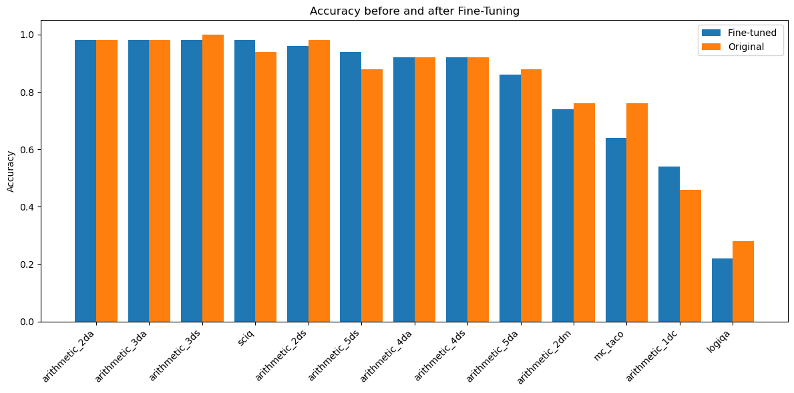

# LogicGPT
 
## 1. Model Selection
I chose to use the pre-trained LLM Mistral 7B, because of the following reasons:
- It can be quantized while still having a good performance, in terms of remembering a conversation, applying a context
- It can be run with GPU on most commercial computers, although in this project we are running the final inference on CPU
- It has a faster and better inference because of using a novel attention mechanism called Grouped Query Attention, increased attention heads, having a larger context length, and using a Key-Value cache.

## 2. Quantization
The quantization was performed to do the inference quickly on my local machine without a GPU. In particular, I used "q4_k_m". It is medium-sized and has a balanced quality. The quantization is done in `finetuning.ipynb`.

## 3. Model Fine-Tuning
### Dataset
For fine-tuning, I used the [Open-Platypus](https://huggingface.co/datasets/garage-bAInd/Open-Platypus) dataset. It consists of questions on Math, Science, reading comprehension, coding, and Logic.
The dataset was chosen because:
- I heard that LLMs do not show good performance for logical reasoning and maths questions. I was curious if I can improve them by finetuning myself.
- Much preprocessing was done to the dataset to ensure a high-quality, which includes:
   - pairs of sentences with similarity above 80% were removed, the similarity was computed with Sentence Transformers and using keyword search
   - questions similar to the questions in Hugging Face benchmark test sets were removed

### Fine-tuning Methodology
The finetuning was done using:
- Unsloth, a framework that facilitates and speeds up fine-tuning,
- SFTTrainer of HuggingFace, Supervised Fine-tuning Trainer
I used LoRA approach for finetuning. 
The finetuning is done in the notebook in `finetuning.ipynb` in Google Colab with the free NVIDIA T4 GPU.

## 4. Model Evaluation
To evaluate Mistral 7B before and after fine-tuning, I used the framework [lm-evaluation-harness](https://github.com/EleutherAI/lm-evaluation-harness). 

The setup for the evaluation of the **fine-tuned model** was as follows:

1. I launched the server with the model in GGUF format with [llama-cpp-python](https://github.com/abetlen/llama-cpp-python):

   ```bash
   python -m llama_cpp.server --model model/unsloth.Q4_K_M.gguf
   ```
2. Run the evaluation with lm-evaluation-harness by passing the local server address of the model:
   ```bash
   lm_eval --model gguf --model_args base_url=http://localhost:8000 --tasks arithmetic --limit 10 --log_samples --output_path 'finetuned_eval_arithmetic_results'
   ```

To evaluate the original Mistral 7B **before fine-tuning**, I used Google Colab as it is faster, and the evaluation of both models is possible this way. 
The notebook is available at `evaluation/original_model_evaluation.ipynb`.

In particular, I evaluated both models on datasets similar to those on which the fine-tuning was done. They included science questions from the dataset `sciq`, comments generation for code from `codeXglue`, numerical calculations from `arithmetic`, reading comprehension questions from `mc_taco` and logical reasoning questions from `logiqa`. The evaluation metrics were predefined by the framework, with outputs for `codeXglue` evaluated with Smoothed BLEU-4, and the rest of the datasets were evaluated with Accuracy. 20 questions per programming language for `codeXglue` and 50 questions per question type for other datasets were asked from the 2 models (not the whole dataset due to time limitations). The datasets' results can be seen in the folder `evaluation`. They are visualized with the script `evaluation/visualization.ipynb`. 

As can be seen from the plots 

<p align="center">
 
</p>

<p align="center">
 
</p>

## 5. API Creation
The API was implemented using FastAPI. For inference I am loading the GGUF file created in the notebook with Llamma.cpp. The GGUF file could not be loaded into this repository due to size limitations of 2GB. Therefore it is downloaded from Google Drive before running the API.

To run locally, Docker Hub credentials where the docker-image is stored, and the latest Docker-Image commit-id should be written in the file `.env`:
   ```bash
   DOCKERHUB_USERNAME=dockerhub_username
   DOCKERHUB_PASSWORD=dockerhub_password
   DOCKER_IMAGE_TAG=tag
   ```

Then the API can be initialized with the command
   ```bash
   docker compose -f compose.yaml up --build
   ```

## 6. Containerization
All the necessary packages and application deployment are included in `Dockerfile`. It is used in CI/CD Pipeline and during the location execution.

## 7. CI/CD Pipeline with GitHub Actions
The pipeline (`.github/workflows/ci.yaml`) includes all necessary steps, including linting the Python code, building the Docker image, downloading the model, starting the API, and running the tests.

In case no changes were made to Dockerfile, there is no need to build the docker-image again (takes around 10 minutes), therefore I included the option of not skipping the job `docker_build` in `.github/workflows/ci.yaml`. It can be done by:
1. setting all definitions of `TO_BUILD_DOCKER` to `false`, like so `TO_BUILD_DOCKER: false`,
2. setting the definition of `PREV_IMAGE_TAG` to the latest Docker image's tag, no need to change if not changed recently
3. comment line 79 (`needs: docker_build` in the job `test_api_with_model`), since we are not running `docker-build`.

Undo the above steps to rebuild and save a new Docker image.
